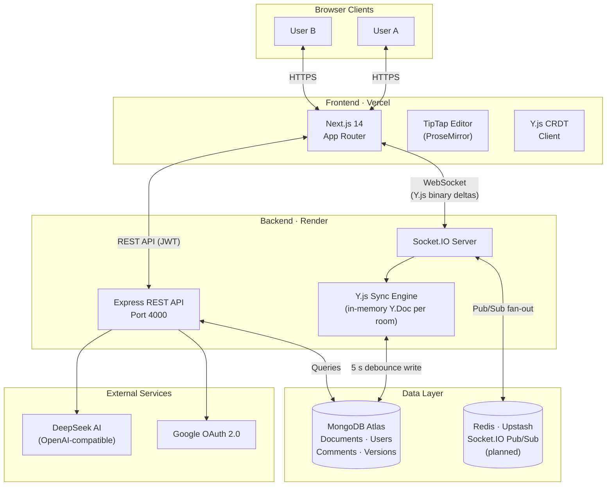

# CollabDocs


[](https://github.com/imsumit28/CollabDocs/actions/workflows/ci.yml)
[](https://nodejs.org)
[](https://nextjs.org)
[](https://mongodb.com)
[](https://socket.io)
[](https://www.typescriptlang.org)
[](LICENSE)

> A production-ready real-time collaborative document editor — think Google Docs, built from scratch. Multiple users edit simultaneously with live cursors, conflict-free CRDT sync, AI writing assistance, and version history.

**[Live Demo](https://collabdocs2026.vercel.app)** · **[API Docs](https://collabdocs2026.vercel.app/api/docs)** · **[GitHub](https://github.com/imsumit28/CollabDocs)**

---

## Table of Contents

- [Features](#features)
- [Architecture](#architecture)
- [Tech Stack](#tech-stack)
- [Setup](#setup)
- [Design Decisions](#design-decisions)
- [Testing](#testing)
- [API Reference](#api-reference)
- [Security](#security)
- [Deployment](#deployment)

---

## Features

**Real-Time Collaboration**
- **Live co-editing** — Multiple users type simultaneously via Y.js CRDT + Socket.IO. Changes propagate in ~100ms with zero conflicts.
- **Live cursors** — Each collaborator gets a unique colour cursor with their name label, updated in real time.
- **Comments** — Inline comments anchored to text ranges, with reply threads and resolve/reopen flow.
- **Notifications** — In-app notification bell for shares, comments, and @mentions (both in comments and typed `@username` in the document body), with unread badge and mark-as-read.
- **Suggestions mode** — Track Changes-style mode built with free TipTap extensions. No paid Pro license required.
- **Version history** — Browse and restore past snapshots of any document.
- **Auto-save** — Documents persist every 5 seconds of inactivity via debounced writes to MongoDB.
- **Offline & installable (PWA)** — Install to your home screen/desktop; opened documents stay editable offline (Y.js + IndexedDB) and merge automatically on reconnect. A service worker caches the app shell with an offline fallback page.

**User Features**
- **AI writing assistant** — Improve prose, fix grammar, summarise, expand, simplify, shift tone, translate, outline, brainstorm, and generate titles. Responses **stream in token-by-token**. Powered by DeepSeek (OpenAI-compatible API).
- **Sharing** — Invite specific people by email (View or Edit) — from either the editor or the dashboard — or share via link with View or Edit permission levels.
- **Search** — Server-side search across all your documents by title *and* content (a plain-text mirror is kept in sync on save; run `npm run backfill:search` once to index documents created before this feature).
- **Folders** — Organise your documents into folders from the sidebar; move docs in/out from the card menu. Deleting a folder keeps its documents (they return to root).
- **Export** — Download as PDF or DOCX.
- **Authentication** — Email/password with JWT + Google OAuth, email verification, and secure password reset (tokenised, single-use, 1-hour expiry).
- **Account settings** — Update profile (name, username, avatar) and change password from a dedicated settings page.

**Production-Ready**
- **173 server tests** — Auth, documents, folders, comments, versions, search, notifications, and real-time sync covered at ~70% overall, plus client component tests (Jest + React Testing Library) and browser E2E (Playwright).
- **Structured logging** — Leveled JSON logs via pino (pretty-printed in dev), with HTTP request logging and secret redaction.
- **Interactive API docs** — Swagger/OpenAPI UI at `/api/docs` with request examples.
- **Security-first** — Rate limiting, input validation, CORS, Helmet headers, XSS/CSRF protection.
- **Full TypeScript** — End-to-end type safety across client and server.

---

## Architecture

### System Overview



### Real-Time Collaboration Flow

```
Browser A                  Server                  Browser B
   │                          │                          │
   │── JWT handshake ────────►│ verify token             │
   │                          │                          │
   │── doc:join { docId } ───►│ check access             │
   │                          │ init Y.Doc (or load DB)  │
   │◄── yjs:sync (full state)─│                          │
   │                          │◄── doc:join ─────────────│
   │                          │─── yjs:sync ────────────►│
   │                          │                          │
   │ [user types]             │                          │
   │── yjs:update (delta) ───►│ apply to Y.Doc           │
   │                          │── yjs:update ───────────►│ (relay)
   │                          │                          │
   │                          │  [5 s debounce]          │
   │                          │  save to MongoDB         │
   │◄── doc:saved ────────────│─── doc:saved ───────────►│
   │                          │                          │
   │ [tab closed]             │                          │
   │── disconnect             │ emit doc:awareness       │
   │                          │ flush Y.Doc if last user │
```

1. **Auth** — JWT access token sent in Socket.IO handshake. Rejected connections never reach event handlers.
2. **Join** — Server loads serialised `Y.Doc` from MongoDB into a shared in-memory instance for the room, then sends full state to the joining client.
3. **Update relay** — Every keystroke produces a tiny binary Y.js delta. The server applies it to the in-memory `Y.Doc` and fans it out to all peers. No round-trip serialisation.
4. **Persistence** — A 5-second debounce timer resets on every update. On expiry the server encodes the `Y.Doc` and writes to MongoDB as a `Buffer`. This bounds write amplification to ≤ 12 writes/minute regardless of typing speed.
5. **Disconnect cleanup** — The handler re-broadcasts the updated presence list (deduplicated by user ID for multi-tab) and flushes the `Y.Doc` if the room is now empty.

### Directory Structure

```
collabdocs/
├── client/                    # Next.js 14 frontend
│   ├── app/
│   │   ├── (auth)/            # Login + Signup pages
│   │   ├── dashboard/         # Document list
│   │   └── doc/[id]/          # Editor + collaboration
│   ├── components/            # Shared UI components
│   ├── contexts/              # AuthContext, ToastContext
│   └── lib/                   # API client, Socket.IO singleton, Y.js provider
│
└── server/                    # Node.js + Express backend
    ├── API.md                 # Complete REST API reference
    ├── TESTING.md             # Testing guide
    └── src/
        ├── routes/            # auth, documents, versions, ai, export, comments
        ├── socket/            # Socket.IO server + Y.js sync engine
        ├── models/            # Mongoose schemas (User, Document, Comment, Version)
        ├── middleware/        # JWT auth, rate limiting
        ├── utils/             # JWT helpers, validation, env validation
        ├── swagger.ts         # OpenAPI 3.0 spec
        └── __tests__/         # Jest test suites
```

---

## Tech Stack

| Layer | Technology | Why |
|-------|-----------|-----|
| **Frontend** | Next.js 14, React 18 | App Router, SSR, file-based routing |
| **Editor** | TipTap (ProseMirror) | Extensible rich-text with CRDT bindings |
| **Real-Time** | Socket.IO 4, Y.js | CRDT sync + WebSocket transport |
| **Backend** | Node.js, Express, TypeScript | Familiar, fast, type-safe |
| **Database** | MongoDB (Mongoose) | Schema-flexible for documents/binary Y.js state |
| **Cache/Scale** | Redis (Upstash) *(optional)* | Socket.IO event fan-out across instances (not full multi-instance Y.Doc scaling — see Design Decisions) |
| **Auth** | JWT (HS256), Google OAuth (Passport.js) | Stateless, XSS-safe token strategy |
| **AI** | DeepSeek API (OpenAI-compatible) | Fast inference |
| **Logging** | pino + pino-http | Structured leveled JSON logs (pretty in dev), aggregator-friendly |
| **Styling** | Tailwind CSS | Utility-first, consistent design tokens |
| **Hosting** | Vercel + Render | Zero-config deploys from GitHub |

---

## Setup

### Prerequisites

| Service | Where to get it | Required? |
|---------|----------------|-----------|
| Node.js 20+ | [nodejs.org](https://nodejs.org) | Yes |
| MongoDB Atlas | [cloud.mongodb.com](https://cloud.mongodb.com) — free M0 cluster | Yes |
| DeepSeek API key | [platform.deepseek.com](https://platform.deepseek.com) | Yes (AI features) |
| Google Cloud project | [console.cloud.google.com](https://console.cloud.google.com) | Optional (OAuth only) |
| Upstash Redis | [upstash.com](https://upstash.com) — free database | Optional (future scaling) |

### 1. Clone and install

```bash
git clone https://github.com/imsumit28/CollabDocs.git
cd CollabDocs
npm install
```

### 2. Configure environment variables

```bash
cp server/.env.example server/.env
cp client/.env.example client/.env.local
```

**`server/.env` — key variables to fill in:**

```bash
# MongoDB: get connection string from Atlas > Connect > Drivers
MONGODB_URI=mongodb+srv://<user>:<password>@cluster.mongodb.net/collabdocs

# Redis: optional — only needed for horizontal scaling across multiple instances
# In future: get from Upstash console > REST API > REDIS_URL
# REDIS_URL=redis://default:<password>@<host>:<port>

# Generate with: node -e "console.log(require('crypto').randomBytes(32).toString('hex'))"
JWT_ACCESS_SECRET=<32-char-hex>
JWT_REFRESH_SECRET=<32-char-hex>

# DeepSeek: copy from platform.deepseek.com > API Keys
DEEPSEEK_API_KEY=sk-...
DEEPSEEK_MODEL=deepseek-v4-flash

# Google OAuth (optional): create at console.cloud.google.com > Credentials
GOOGLE_CLIENT_ID=...apps.googleusercontent.com
GOOGLE_CLIENT_SECRET=...

# These work as-is for local dev
PORT=4000
NODE_ENV=development
CLIENT_URL=http://localhost:3000
API_URL=http://localhost:4000
```

**`client/.env.local` — two variables, both point to the backend:**

```bash
NEXT_PUBLIC_API_URL=http://localhost:4000
NEXT_PUBLIC_SOCKET_URL=http://localhost:4000
```

### 3. Run in development

```bash
npm run dev
# Frontend → http://localhost:3000
# Backend  → http://localhost:4000
# API Docs → http://localhost:4000/api/docs
```

Or run individually:

```bash
npm run dev --workspace=client   # Frontend only
npm run dev --workspace=server   # Backend only
```

### Troubleshooting

| Problem | Fix |
|---------|-----|
| MongoDB connection error | Whitelist your IP in Atlas → Network Access → Add IP |
| Socket.IO fails in browser | Check `NEXT_PUBLIC_SOCKET_URL` matches the running backend port |
| Port 3000/4000 in use | `npx kill-port 3000 4000` |
| Tests failing after env change | `npm run test -- --clearCache` |

---

## Design Decisions

### 1. Y.js CRDT instead of Operational Transformation

The central architecture question for any collaborative editor is: how do you merge concurrent edits?

| | OT (Google Docs approach) | CRDT (CollabDocs) |
|---|---|---|
| Conflict resolution | Server serialises all ops, transforms concurrent ones | Each client merges independently — always converges |
| Server role | Central arbiter required | Dumb relay — no conflict logic needed |
| Offline support | Hard — requires reconnect protocol | Built-in — merge on reconnect automatically |
| Horizontal scaling | Difficult without sticky sessions | Easier in principle — deltas are commutative — though this app's server still holds per-instance state (see note below) |

**Why CRDT:** The server is mostly a relay. It applies deltas to an in-memory `Y.Doc` and broadcasts them, with no conflict-resolution logic. The CRDT model *makes* horizontal scaling tractable (deltas commute, so order doesn't matter), but this implementation still keeps an authoritative `Y.Doc` per instance for persistence — so it targets a single backend instance today. See [Design Decision 4](#4-single-instance-real-time-with-a-redis-adapter-for-event-fan-out) for what multi-instance would require.

**How conflicts resolve in practice:**

```
Initial:  "Hello"
User A (offline): inserts " World" at pos 5  →  "Hello World"
User B (offline): inserts " There" at pos 5  →  "Hello There"

After sync: both clients converge to "Hello World There"
(peer ID ordering determines sequence — same result everywhere)
```

Insertions never destroy each other. Deletions become tombstones internally. Cursor positions are Y.js *relative positions* (anchored to a character identity, not an index), so remote edits never misplace your cursor.

---

### 2. JWT in memory + HttpOnly refresh cookies

Storing JWTs in `localStorage` means any XSS payload can exfiltrate them. The strategy here:

- **Access token (15 min)** — held in React state only. Never written to the DOM or storage. Lost on page refresh (by design).
- **Refresh token (7 days)** — stored in an `HttpOnly`, `Secure`, `SameSite=Strict` cookie. JavaScript cannot read it; the browser sends it automatically.

On page load the client silently calls `/api/auth/refresh` — the browser sends the cookie, the server returns a new access token in the JSON body. This gives the "stay logged in" UX without exposing credentials to JS.

---

### 3. Debounced MongoDB writes (5 s)

Naive approach: write to the database on every keystroke. At 5 chars/second, that's 300 writes/minute per active user.

CollabDocs instead keeps a per-room `Y.Doc` in memory and resets a 5-second debounce timer on every update. On expiry, one write happens. This bounds write amplification to **≤ 12 writes/minute regardless of typing speed** while keeping data loss risk to ≤ 5 seconds of edits.

---

### 4. Single-instance real-time, with a Redis adapter for event fan-out

The app is designed to run as a **single backend instance** (Render free tier), and that's the configuration it's correct for.

`@socket.io/redis-adapter` is integrated and activates automatically when `REDIS_URL` is set. It solves *one* part of multi-instance scaling — Socket.IO event fan-out, so presence and relayed updates reach sockets connected to other instances.

**It does not, by itself, make the app safe to run on multiple instances.** Each instance keeps its own authoritative `Y.Doc` for a document in memory and only applies the updates from sockets connected to *that* instance, then debounce-persists the whole state to MongoDB. With two instances editing the same document, their in-memory copies diverge and the periodic save becomes last-writer-wins — edits can be lost.

True horizontal scaling would require one of:
- **Sticky routing per document** (all sockets for a given doc land on the same instance), or
- **A shared Y.js persistence/sync layer** (e.g. a dedicated y-websocket/y-redis service that owns the authoritative document) so no single app instance holds private state.

Both are out of scope for the free single-instance deployment; this is called out honestly rather than claimed as "scale by adding an env var."

---

### 5. TipTap (ProseMirror) over Slate or Quill

TipTap has a first-class `y-prosemirror` binding for Y.js CRDT sync, and its extension system made building comments, suggestions mode, slash commands, and @mentions straightforward. Slate would have required building the Y.js binding from scratch. Quill is significantly more constrained for custom extensions.

---

## Testing

```bash
npm run test --workspace=server              # Run all tests + coverage report
npm run test:watch --workspace=server        # Watch mode
npm run test:ci --workspace=server           # CI mode (strict coverage threshold)
```

**Server** tests run against an in-memory MongoDB (`mongodb-memory-server`) — no local database or paid cluster required, so the suite runs offline and in CI out of the box. **Client** tests use Jest + React Testing Library (via `next/jest`), and **end-to-end** tests use Playwright with all API calls mocked via route interception (no backend or DB needed — deterministic and free).

```bash
npm run test:ci --workspace=client   # Client component tests
npm run test:e2e --workspace=client  # Playwright E2E (auto-starts the app)
```

| Module | Test Cases |
|--------|-----------|
| Auth Routes | 33 |
| Document Routes | 35 |
| Folder Routes | 11 |
| Comment Routes | 19 |
| Version Routes | 10 |
| Export Routes | 5 |
| AI (validation + streaming) | 8 |
| Document access (authz) | 9 |
| Notifications (routes + mentions) | 13 |
| Search backfill | 5 |
| Env / health | 10 |
| WebSocket / CRDT + API docs | ~15 |
| **Server overall** | **173 tests · ~70% coverage** |
| Client (Jest) | 7 |
| End-to-end (Playwright) | 5 |

Tests cover: signup/login/refresh/logout, document CRUD/pagination and access control, folders (create/rename/delete, move, folder-scoped listing), comment authorization, share-token permission resolution, version snapshot/restore, PDF/DOCX export, AI input-length limits + streaming, in-document and comment @mention notifications, the content-search backfill, env/health checks, Y.js CRDT concurrent edits and offline merges, plus browser E2E for the login and password-reset flows.

See [server/TESTING.md](server/TESTING.md) for the full testing guide.

---

## API Reference

Interactive Swagger UI available at `http://localhost:4000/api/docs` when the server is running.

**Key endpoints:**

| Method | Endpoint | Description |
|--------|----------|-------------|
| `POST` | `/api/auth/signup` | Create account |
| `POST` | `/api/auth/login` | Login, receive access token + refresh cookie |
| `GET` | `/api/auth/me` | Current user profile |
| `PATCH` | `/api/auth/me` | Update display name, username, or avatar |
| `POST` | `/api/auth/change-password` | Change password (verifies current, re-issues session) |
| `POST` | `/api/auth/refresh` | Exchange refresh cookie for new access token |
| `POST` | `/api/auth/forgot-password` | Request a password-reset email (generic response — no account enumeration) |
| `POST` | `/api/auth/reset-password` | Set a new password using a valid reset token |
| `GET` | `/api/documents` | List owned + shared documents (add `?page=N&limit=M` for a `{ items, total, page, totalPages, hasMore }` envelope; omit for the full array) |
| `GET` | `/api/documents/search?q=` | Search owned + shared docs by title and content |
| `POST` | `/api/documents` | Create document |
| `GET` | `/api/documents/:id` | Get document content |
| `PATCH` | `/api/documents/:id` | Update title and/or move to a folder (`{ folderId }`, owner only; `null` = root) |
| `DELETE` | `/api/documents/:id` | Soft-delete (trash) |
| `POST` | `/api/documents/:id/share` | Generate share link |
| `GET` | `/api/documents/:id/collaborators` | List people with access (owner + collaborators) |
| `POST` | `/api/documents/:id/collaborators` | Invite/update a collaborator by email (owner only) |
| `DELETE` | `/api/documents/:id/collaborators/:userId` | Remove a collaborator (owner only) |
| `GET` | `/api/folders` | List my folders with document counts |
| `POST` | `/api/folders` | Create a folder |
| `PATCH` | `/api/folders/:id` | Rename a folder (owner only) |
| `DELETE` | `/api/folders/:id` | Delete a folder (its documents return to root) |
| `GET` | `/api/versions/:docId` | List document versions |
| `POST` | `/api/versions/:docId` | Save named snapshot |
| `POST` | `/api/comments` | Add inline comment |
| `GET` | `/api/comments/:docId` | List comments |
| `PATCH` | `/api/comments/:id/resolve` | Resolve comment |
| `GET` | `/api/notifications` | List my notifications + unread count |
| `PATCH` | `/api/notifications/:id/read` | Mark a notification read |
| `POST` | `/api/notifications/read-all` | Mark all my notifications read |
| `POST` | `/api/ai/{improve,grammar,summarize,expand,simplify,tone,outline,brainstorm,translate,title}` | AI writing actions. Add `?stream=1` to stream the response as plain-text chunks; otherwise returns `{ result }` |
| `POST` | `/api/export/:id/pdf` | Export as PDF |
| `POST` | `/api/export/:id/docx` | Export as DOCX |

**WebSocket events (Socket.IO):**

| Event | Direction | Description |
|-------|-----------|-------------|
| `doc:join` | client → server | Join a document room. Payload `{ docId, shareToken? }` — `shareToken` is required for link-based access by non-collaborators and is verified against the document's active share link. |
| `doc:permission` | server → client | The joining user's authorized permission (`owner` / `edit` / `view`). Viewers receive a read-only editor and their `yjs:update` writes are rejected server-side. |
| `yjs:sync` | server → client | Full Y.Doc state on join |
| `yjs:update` | bidirectional | Binary Y.js delta (keystroke). Only relayed/applied for participants with edit access. |
| `doc:awareness` | bidirectional | Cursor position + user presence |
| `doc:saved` | server → client | Persistence confirmation |

See [server/API.md](server/API.md) for curl examples and full schema documentation.

---

## Security

- **JWT strategy** — Access tokens in memory (not `localStorage`), refresh tokens in `HttpOnly` cookies — XSS cannot exfiltrate credentials.
- **Rate limiting** — Auth endpoints: 5 req/15 min. AI endpoint: 30 req/hour per user.
- **Input validation** — Email format, password strength (configurable), display name length, document title, comment body, AI input length.
- **Helmet.js** — Strict Content Security Policy, X-Frame-Options, HSTS, and other security headers.
- **bcryptjs** — Passwords hashed with 12 salt rounds.
- **CORS** — Restricted to configured `CLIENT_URL` origin.
- **Environment validation** — Server refuses to start if required secrets are missing or too short.
- **Email verification enforcement** — Optional (`REQUIRE_EMAIL_VERIFICATION=true`): unverified password accounts can't log in. OAuth accounts are always verified.
- **Graceful shutdown** — On `SIGTERM`/`SIGINT` the server persists every open document room before exiting, so edits within the debounce window survive a deploy/restart.
- **DB-aware health check** — `/health` returns `503` when the database is unreachable so load balancers and uptime monitors can detect a degraded instance.

See [SECURITY.md](SECURITY.md) for threat model, hardening checklist, and incident reporting.

---

## Deployment

### Frontend → Vercel

1. Push to GitHub
2. Import the repo in Vercel, set root to `client`
3. Add environment variable: `NEXT_PUBLIC_API_URL=https://your-backend.onrender.com`
4. Add: `NEXT_PUBLIC_SOCKET_URL=https://your-backend.onrender.com`

### Backend → Render

1. Create a new Web Service, connect the GitHub repo
2. Set **Root Directory** to `server`
3. Build command: `npm install && npm run build`
4. Start command: `npm run start`
5. Add all variables from `server/.env.example` (MongoDB URI, JWT secrets, etc.) — `REDIS_URL` is optional

**Production env checklist:**

```bash
# Generate strong JWT secrets
node -e "console.log(require('crypto').randomBytes(32).toString('hex'))"

NODE_ENV=production
PASSWORD_MIN_LENGTH=12
PASSWORD_REQUIRE_UPPERCASE=true
PASSWORD_REQUIRE_NUMBERS=true
REQUIRE_EMAIL_VERIFICATION=true   # once SMTP_* is configured
```

---

## Contributing

See [CONTRIBUTING.md](CONTRIBUTING.md) for dev setup, code standards, and the PR process.

Key commands:

```bash
npm run type-check          # TypeScript validation (both workspaces)
npm run lint                # ESLint
npm run test --workspace=server   # Run tests
```

Pre-commit hooks (Husky + lint-staged) run ESLint and Prettier automatically.

Every push and pull request to `main` runs the [CI workflow](.github/workflows/ci.yml): type-check, lint, the full server test suite (with coverage, against an in-memory MongoDB), and a production client build.

---

## License

MIT — see [LICENSE](LICENSE).
