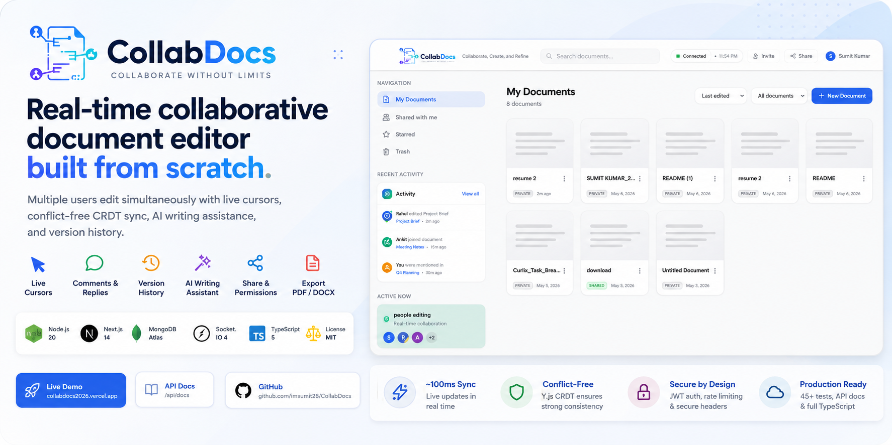
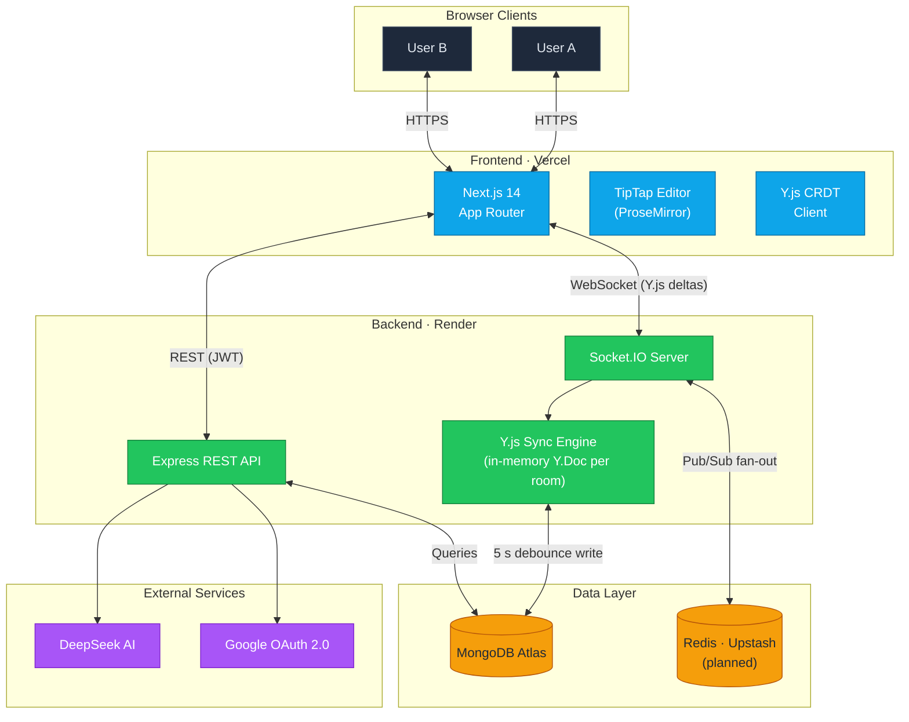

<div align="center">

# CollabDocs



[](https://github.com/imsumit28/CollabDocs/actions/workflows/ci.yml)
[](https://nodejs.org)
[](https://nextjs.org)
[](https://mongodb.com)
[](https://socket.io)
[](https://www.typescriptlang.org)
[](LICENSE)

**Real-time collaborative document editor — Google Docs, built from scratch.**

Multiple users edit the same document simultaneously with live cursors, conflict-free CRDT sync, AI writing assistance, and version history.

**[Live Demo](https://collabdocs2026.vercel.app)** · **[API Docs](https://collabdocs2026.vercel.app/api/swagger)** · **[GitHub](https://github.com/imsumit28/CollabDocs)**

</div>

---

## Highlights

| | |
|---|---|
| **Live co-editing** | Multiple users type at once via Y.js CRDT + Socket.IO — changes propagate in ~100 ms with zero conflicts and live name-labelled cursors. |
| **AI writing assistant** | Improve, summarise, expand, translate, change tone, and more — responses stream in token-by-token (DeepSeek, OpenAI-compatible). |
| **Offline & installable (PWA)** | Install to desktop/home screen; documents stay editable offline (Y.js + IndexedDB) and merge automatically on reconnect. |
| **Version history** | Browse and restore past snapshots; auto-save persists every 5 s of inactivity. |
| **Comments & mentions** | Inline threaded comments, resolve/reopen, and `@mention` notifications across comments and the document body. |
| **Production-grade auth** | Email/password + Google OAuth, email verification, secure single-use password reset, XSS-safe JWT strategy. |

<details>
<summary><strong>See the full feature list</strong></summary>

### Real-Time Collaboration
- **Live co-editing** — Multiple users type simultaneously via Y.js CRDT + Socket.IO. Changes propagate in ~100ms with zero conflicts.
- **Live cursors** — Each collaborator gets a unique colour cursor with their name label, updated in real time.
- **Comments** — Inline comments anchored to text ranges, with reply threads and resolve/reopen flow.
- **Notifications** — In-app notification bell for shares, comments, and @mentions (both in comments and typed `@username` in the document body), with unread badge and mark-as-read.
- **Suggestions mode** — Track Changes-style mode built with free TipTap extensions. No paid Pro license required.
- **Version history** — Browse and restore past snapshots of any document.
- **Auto-save** — Documents persist every 5 seconds of inactivity via debounced writes to MongoDB.
- **Offline & installable (PWA)** — Install to your home screen/desktop; opened documents stay editable offline (Y.js + IndexedDB) and merge automatically on reconnect. A service worker caches the app shell with an offline fallback page.

### User Features
- **AI writing assistant** — Improve prose, fix grammar, summarise, expand, simplify, shift tone, translate, outline, brainstorm, and generate titles. Responses **stream in token-by-token**. Powered by DeepSeek (OpenAI-compatible API).
- **Sharing** — Invite specific people by email (View or Edit) — from either the editor or the dashboard — or share via link with View or Edit permission levels.
- **Search** — Server-side search across all your documents by title *and* content (a plain-text mirror is kept in sync on save; run `npm run backfill:search` once to index documents created before this feature).
- **Folders** — Organise your documents into folders from the sidebar; move docs in/out from the card menu. Deleting a folder keeps its documents (they return to root).
- **Export** — Download as PDF or DOCX.
- **Authentication** — Email/password with JWT + Google OAuth, email verification, and secure password reset (tokenised, single-use, 1-hour expiry).
- **Account settings** — Update profile (name, username, avatar) and change password from a dedicated settings page.

### Production-Ready
- **325 server tests** — Auth, documents, folders, comments, versions, search, notifications, and real-time sync covered at ~88% overall, plus client component tests (Jest + React Testing Library) and browser E2E (Playwright).
- **Structured logging** — Leveled JSON logs via pino (pretty-printed in dev), with HTTP request logging and secret redaction.
- **Interactive API docs** — Swagger/OpenAPI UI at `/api/swagger` with request examples.
- **Security-first** — Rate limiting, input validation, CORS, Helmet headers, XSS/CSRF protection.
- **Full TypeScript** — End-to-end type safety across client and server.

</details>

---

## Architecture



The server is a **dumb relay**: it applies binary Y.js deltas to an in-memory `Y.Doc` per room and fans them out — no conflict-resolution logic — then debounce-persists to MongoDB.

**Full data flow, real-time sequence, and directory layout → [docs/ARCHITECTURE.md](docs/ARCHITECTURE.md)**

**Why CRDT over OT, the JWT strategy, scaling trade-offs → [docs/DESIGN_DECISIONS.md](docs/DESIGN_DECISIONS.md)**

---

## Tech Stack

| Layer | Technology | Why |
|-------|-----------|-----|
| **Frontend** | Next.js 14, React 18 | App Router, SSR, file-based routing |
| **Editor** | TipTap (ProseMirror) | Extensible rich-text with CRDT bindings |
| **Real-Time** | Socket.IO 4, Y.js | CRDT sync + WebSocket transport |
| **Backend** | Node.js, Express, TypeScript | Familiar, fast, type-safe |
| **Database** | MongoDB (Mongoose) | Schema-flexible for documents/binary Y.js state |
| **Cache/Scale** | Redis (Upstash) *(optional)* | Socket.IO event fan-out across instances ([details](docs/DESIGN_DECISIONS.md#4-single-instance-real-time-with-a-redis-adapter-for-event-fan-out)) |
| **Auth** | JWT (HS256), Google OAuth (Passport.js) | Stateless, XSS-safe token strategy |
| **AI** | DeepSeek API (OpenAI-compatible) | Fast streaming inference |
| **Logging** | pino + pino-http | Structured leveled JSON logs, aggregator-friendly |
| **Styling** | Tailwind CSS | Utility-first, consistent design tokens |
| **Hosting** | Vercel + Render | Zero-config deploys from GitHub |

---

## Quick Start

> **Prerequisites:** Node.js 20+, a [MongoDB Atlas](https://cloud.mongodb.com) free cluster, and a [DeepSeek API key](https://platform.deepseek.com) (for AI features). Google OAuth and Redis are optional.

```bash
# 1. Clone and install
git clone https://github.com/imsumit28/CollabDocs.git
cd CollabDocs
npm install

# 2. Configure environment
cp server/.env.example server/.env          # fill in MONGODB_URI, JWT secrets, DEEPSEEK_API_KEY
cp client/.env.example client/.env.local    # both vars point at the backend

# 3. Run
npm run dev
# Frontend → http://localhost:3000
# Backend  → http://localhost:4000
# API Docs → http://localhost:4000/api/swagger
```

**Full setup walkthrough, env variable reference → [docs/QUICK_START.md](docs/QUICK_START.md)**

<details>
<summary><strong>Troubleshooting</strong></summary>

| Problem | Fix |
|---------|-----|
| MongoDB connection error | Whitelist your IP in Atlas → Network Access → Add IP |
| Socket.IO fails in browser | Check `NEXT_PUBLIC_SOCKET_URL` matches the running backend port |
| Port 3000/4000 in use | `npx kill-port 3000 4000` |
| Tests failing after env change | `npm run test -- --clearCache` |

Run services individually:

```bash
npm run dev --workspace=client   # Frontend only
npm run dev --workspace=server   # Backend only
```

</details>

---

## Security

- **XSS-safe JWT** — access tokens in memory (never `localStorage`), refresh tokens in `HttpOnly` `Secure` `SameSite=Strict` cookies.
- **Rate limiting** — auth endpoints 5 req/15 min, AI endpoint 30 req/hour per user.
- **Hardening** — Helmet CSP/HSTS, bcrypt (12 rounds), CORS lockdown, input validation, and startup env validation that refuses to boot on weak/missing secrets.
- **Resilience** — graceful shutdown persists open docs before exit; `/health` returns `503` when the DB is unreachable.

**Threat model & hardening checklist → [SECURITY.md](SECURITY.md)** · **JWT rationale → [docs/DESIGN_DECISIONS.md](docs/DESIGN_DECISIONS.md#2-jwt-in-memory--httponly-refresh-cookies)**

---

## Testing

**325 server tests** (~88% coverage) against an in-memory MongoDB — no local DB or paid cluster needed, runs offline and in CI. Plus client component tests (Jest + React Testing Library) and 8 browser E2E specs (Playwright with mocked routes).

```bash
npm run test --workspace=server      # Server suite + coverage
npm run test:ci --workspace=client   # Client component tests
npm run test:e2e --workspace=client  # Playwright E2E (auto-starts the app)
```

**Coverage breakdown by module & testing guide → [docs/TESTING.md](docs/TESTING.md)**

---

## API

Interactive Swagger UI at `http://localhost:4000/api/swagger` when the server is running. Highlights:

| Method | Endpoint | Description |
|--------|----------|-------------|
| `POST` | `/api/auth/login` | Login — access token + `HttpOnly` refresh cookie |
| `GET` | `/api/docs` | List owned + shared documents (optional pagination) |
| `GET` | `/api/docs/search?q=` | Search docs by title **and** content |
| `POST` | `/api/docs/:id/share` | Generate a share link (View / Edit) |
| `POST` | `/api/ai/{improve,summarize,translate,...}` | AI writing actions (`?stream=1` to stream) |
| `POST` | `/api/export/:id/{pdf,docx}` | Export a document |

Real-time uses Socket.IO events (`doc:join`, `yjs:sync`, `yjs:update`, `doc:awareness`, `doc:saved`).

**Every REST endpoint, WebSocket event, and curl examples → [docs/API.md](docs/API.md)**

---

## Project Structure

<details>
<summary><strong>Expand directory tree</strong></summary>

```
collabdocs/
├── client/                    # Next.js 14 frontend
│   ├── app/
│   │   ├── (auth)/            # Login + Signup pages
│   │   ├── dashboard/         # Document list
│   │   └── doc/[id]/          # Editor + collaboration
│   ├── components/            # Shared UI components
│   ├── contexts/              # AuthContext, ToastContext
│   └── lib/                   # API client, Socket.IO singleton, Y.js provider
│
├── server/                    # Node.js + Express backend
│   └── src/
│       ├── routes/           # auth, documents, versions, ai, export, comments
│       ├── socket/           # Socket.IO server + Y.js sync engine
│       ├── models/           # Mongoose schemas (User, Document, Comment, Version)
│       ├── middleware/       # JWT auth, rate limiting
│       ├── utils/            # JWT helpers, validation, env validation
│       ├── swagger.ts        # OpenAPI 3.0 spec
│       └── __tests__/        # Jest test suites
│
└── docs/                      # Documentation hub
```

Full annotated layout in [docs/ARCHITECTURE.md](docs/ARCHITECTURE.md#directory-structure).

</details>

---

## Documentation

| Document | What's inside |
|----------|---------------|
| [Quick Start](docs/QUICK_START.md) | Fastest path to a running local instance |
| [Architecture](docs/ARCHITECTURE.md) | System diagram, real-time data flow, directory layout |
| [Design Decisions](docs/DESIGN_DECISIONS.md) | Why CRDT over OT, JWT strategy, scaling trade-offs |
| [API Reference](docs/API.md) | Every REST endpoint with curl examples and schemas |
| [Testing Guide](docs/TESTING.md) | How the test suites are organized and how to run them |
| [Deployment](docs/DEPLOYMENT.md) | Vercel + Render deployment and production checklist |
| [Changelog](docs/CHANGELOG.md) | Version history and notable changes |

Project policies: [Contributing](CONTRIBUTING.md) · [Code of Conduct](CODE_OF_CONDUCT.md) · [Security Policy](SECURITY.md) · [License](LICENSE).

---

<details>
<summary><h2>Roadmap</h2></summary>

CollabDocs is feature-complete for its core use case. Planned enhancements, roughly in priority order:

- [ ] **True horizontal scaling** — replace the per-instance in-memory Y.Doc with a shared `y-websocket`/`y-redis` sync layer so document state is consistent across multiple backend instances (today the Redis adapter only fans out Socket.IO events — see [Design Decisions](docs/DESIGN_DECISIONS.md)).
- [ ] **Anonymous share-link access** — let link-only visitors read documents and comments over REST (currently share tokens are honored on the WebSocket join but REST endpoints still require an account).
- [ ] **Inline @mention autocomplete** — a TipTap mention dropdown in the editor; today in-document mentions are detected from typed `@handle` text.
- [ ] **Transactional email provider** — wire a real SMTP/email service for verification and password-reset mail (development currently logs the link to the console).
- [ ] **Nested folders** — multi-level folder hierarchy (folders are flat/single-level today).
- [ ] **Raster PWA icons** — add 192px/512px PNG icons for broader install support across platforms.

Have an idea? Open a [Discussion](https://github.com/imsumit28/CollabDocs/discussions) or a feature request.

</details>

## Contributing

See [CONTRIBUTING.md](CONTRIBUTING.md) for dev setup, code standards, and the PR process.

```bash
npm run type-check                 # TypeScript validation (both workspaces)
npm run lint                       # ESLint
npm run test --workspace=server    # Run tests
```

Pre-commit hooks (Husky + lint-staged) run ESLint and Prettier automatically. Every push and PR to `main` runs the [CI workflow](.github/workflows/ci.yml): type-check, lint, the full server test suite (with coverage, against an in-memory MongoDB), and a production client build.

---

## License

MIT — see [LICENSE](LICENSE).
