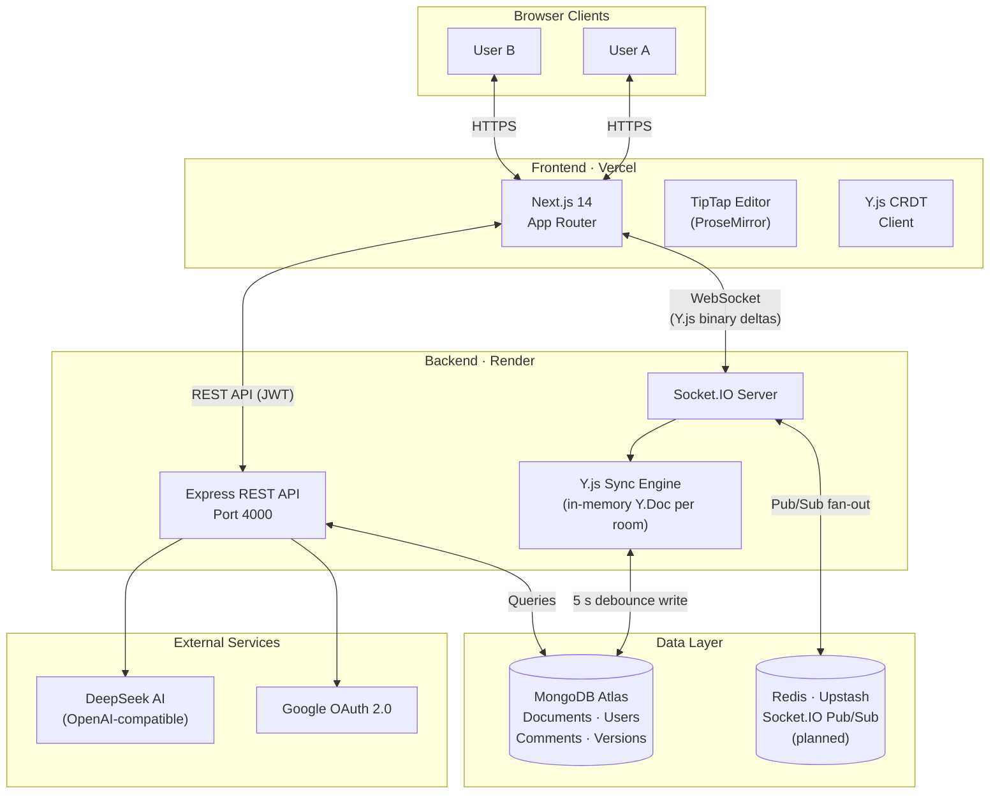

# Architecture

How CollabDocs is structured, how real-time collaboration flows end to end, and how the codebase is organized.

> For *why* these choices were made (CRDT vs OT, JWT strategy, debounced writes, single-instance scaling), see [DESIGN_DECISIONS.md](./DESIGN_DECISIONS.md).

---

## System Overview



---

## Real-Time Collaboration Flow

```
Browser A                  Server                  Browser B
   │                          │                          │
   │── JWT handshake ────────►│ verify token             │
   │                          │                          │
   │── doc:join { docId } ───►│ check access             │
   │                          │ init Y.Doc (or load DB)  │
   │◄── yjs:sync (full state)─│                          │
   │                          │◄── doc:join ─────────────│
   │                          │─── yjs:sync ────────────►│
   │                          │                          │
   │ [user types]             │                          │
   │── yjs:update (delta) ───►│ apply to Y.Doc           │
   │                          │── yjs:update ───────────►│ (relay)
   │                          │                          │
   │                          │  [5 s debounce]          │
   │                          │  save to MongoDB         │
   │◄── doc:saved ────────────│─── doc:saved ───────────►│
   │                          │                          │
   │ [tab closed]             │                          │
   │── disconnect             │ emit doc:awareness       │
   │                          │ flush Y.Doc if last user │
```

1. **Auth** — JWT access token sent in Socket.IO handshake. Rejected connections never reach event handlers.
2. **Join** — Server loads serialised `Y.Doc` from MongoDB into a shared in-memory instance for the room, then sends full state to the joining client.
3. **Update relay** — Every keystroke produces a tiny binary Y.js delta. The server applies it to the in-memory `Y.Doc` and fans it out to all peers. No round-trip serialisation.
4. **Persistence** — A 5-second debounce timer resets on every update. On expiry the server encodes the `Y.Doc` and writes to MongoDB as a `Buffer`. This bounds write amplification to ≤ 12 writes/minute regardless of typing speed.
5. **Disconnect cleanup** — The handler re-broadcasts the updated presence list (deduplicated by user ID for multi-tab) and flushes the `Y.Doc` if the room is now empty.

---

## Directory Structure

```
collabdocs/
├── client/                    # Next.js 14 frontend
│   ├── app/
│   │   ├── (auth)/            # Login + Signup pages
│   │   ├── dashboard/         # Document list
│   │   └── doc/[id]/          # Editor + collaboration
│   ├── components/            # Shared UI components
│   ├── contexts/              # AuthContext, ToastContext
│   └── lib/                   # API client, Socket.IO singleton, Y.js provider
│
├── server/                    # Node.js + Express backend
│   └── src/
│       ├── routes/           # auth, documents, versions, ai, export, comments
│       ├── socket/           # Socket.IO server + Y.js sync engine
│       ├── models/           # Mongoose schemas (User, Document, Comment, Version)
│       ├── middleware/       # JWT auth, rate limiting
│       ├── utils/            # JWT helpers, validation, env validation
│       ├── swagger.ts        # OpenAPI 3.0 spec
│       └── __tests__/        # Jest test suites
│
└── docs/                      # Documentation hub
    ├── ARCHITECTURE.md        # This file
    ├── DESIGN_DECISIONS.md    # Why the key trade-offs were made
    ├── DEPLOYMENT.md          # Vercel + Render deployment guide
    ├── API.md                 # Complete REST API reference
    ├── TESTING.md             # Testing guide
    ├── QUICK_START.md         # Fast local setup
    └── CHANGELOG.md           # Version history
```
